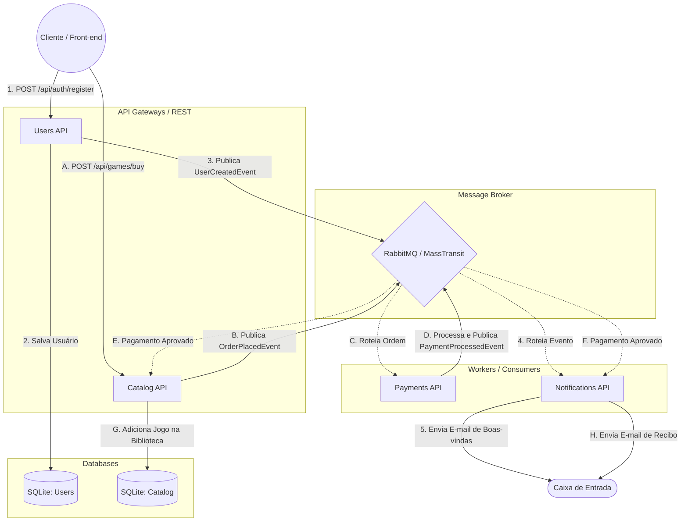

# Fiap Cloud Games - Infraestrutura e Orquestração (Tech Challenge - Fase 2)

Este é o repositório central de infraestrutura e orquestração do projeto **Fiap Cloud Games**. O objetivo principal da Fase 2 foi realizar o desmembramento da arquitetura monolítica (Fase 1) para um ecossistema de Microsserviços Orientados a Eventos (Event-Driven Architecture), visando alta disponibilidade, escalabilidade e menor acoplamento.

## 🏗️ Arquitetura e Decisões Técnicas (O que mudou da Fase 1?)

Na Fase 1, o sistema consistia em um único projeto Monolítico conectado a um único banco de dados. 
Para a Fase 2, dividimos as responsabilidades em 4 microsserviços distintos, cada um com seu próprio repositório e ciclo de vida (CI/CD):

1. **UsersAPI:** Responsável pela autenticação (JWT) e gestão de usuários.
2. **CatalogAPI:** Responsável por gerenciar o catálogo de jogos, promoções e a biblioteca do usuário.
3. **PaymentsAPI:** Responsável pelo processamento assíncrono de pagamentos.
4. **NotificationsAPI:** Responsável pelo envio assíncrono de e-mails.

### Padrão Choreography (Mensageria)
Em vez de utilizar chamadas síncronas pesadas (HTTP/REST) entre os serviços para finalizar uma compra, implementamos o padrão de **Coreografia (Choreography)** utilizando **RabbitMQ** e **MassTransit**.
- Isso elimina o ponto único de falha. Se o serviço de Notificação cair, a compra do usuário não é afetada. A mensagem fica na fila e é enviada quando o serviço voltar.

### Padrão GitOps (Kubernetes)
Para a infraestrutura do Kubernetes, seguimos as melhores práticas de mercado:
- O repositório central (`FiapCloudGames-Infra`) guarda apenas manifestos comuns (`ConfigMaps`, `Secrets`, e `RabbitMQ`).
- O manifesto de *Deployment* e *Service* de cada API fica guardado na pasta `/k8s` **do próprio repositório da API**, garantindo que as equipes tenham autonomia para atualizar seus próprios serviços de forma descentralizada.

---

## 🚀 Como Executar o Projeto

Existem duas maneiras de subir o ambiente.

### Opção 1: Via Docker Compose (Homologação Rápida)
Utilizado para subir todas as APIs, o Banco de Dados, o RabbitMQ e o Dashboard Front-end (Nginx) em um único comando:

1. Abra o terminal na raiz deste repositório (`FiapCloudGames-Infra`).
2. Execute o comando:
   ```bash
   docker-compose up -d --build
   ```
3. Acesse `http://localhost` para visualizar o Dashboard interativo de observabilidade.

### Opção 2: Via Kubernetes (Padrão de Produção)
Para simular um cluster de produção com descentralização de recursos:

1. **Subir a Infraestrutura Base (ConfigMaps, Secrets, RabbitMQ):**
   ```bash
   cd FiapCloudGames-Infra/k8s
   kubectl apply -f .
   ```

2. **Subir as APIs (Vá até o repositório de cada API e aplique seu manifesto):**
   ```bash
   cd ../UsersAPI/k8s
   kubectl apply -f .
   
   cd ../CatalogAPI/k8s
   kubectl apply -f .
   
   cd ../PaymentsAPI/k8s
   kubectl apply -f .
   
   cd ../NotificationsAPI/k8s
   kubectl apply -f .
   ```

3. **Verificar os Pods:**
   ```bash
   kubectl get pods
   ```

---

## 📊 Diagrama de Mensageria

